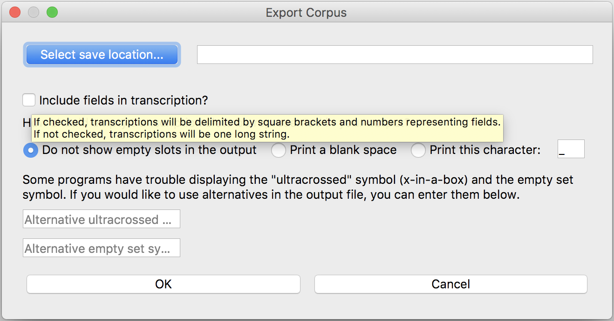
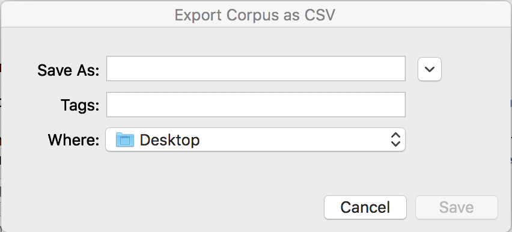

.. _manage_corpus:

***************
Managing a corpus
***************


.. _add_signs:

Adding signs to an existing corpus
`````````````````
To add new signs to an existing corpus, go to "Menu" and select "Load corpus...". This allows you to search your
computer. Only files with the extension ".corpus" are available for selection. Click on a corpus that you would like to
work on, and click "Open".

Alternatively, if you start transcribing a new sign without loading a corpus beforehand, you will get a warning message
when you try to save the sign. You can load a corpus after the message (see :ref:`save_sign`).


.. _delete_signs:

Deleting a sign
`````````````````
To delete a sign from a corpus, click on the sign in the "Corpus" column on the right, and check the "Gloss" box to make sure
that your intended sign is loaded. Then click the "Delete word from corpus" button. Note that this option does not give you
a confirmation message and that a deleted sign cannot be recovered.


.. _new_corpus:

Switching to another corpus
`````````````````
If you once started transcribing signs in one corpus but would like to switch to another corpus and continue on transcribing
your next sign, go to Menu and select "New corpus". This function refreshes the program, and you will see that there is no 
sign listed in the "Corpus" column on the right. You can then load another corpus (see :ref:`load_corpus`).


.. _save_corpus:

Duplicating a corpus
`````````````````
To duplicate a corpus and save it with a different file name, go to "Menu" and select "Save corpus as...". A new window opens, 
titled "Save Corpus File As". 

.. image:: static/save_corpus.png
   :width: 90%
   :align: center

Type in a file name for your new corpus, specify a saving location, and click "Save".


.. _export_corpus:

Exporting a corpus
`````````````````
To export a corpus, go to Menu and select "Export corpus as csv..." A new window titled "Export corpus" will appear.

.. image:: static/export.png
   :width: 90%
   :align: center

If you mouse over the check box next to "Include fields in transcription?", you can see what this means; "If checked, 
transctiptions will be delimited by square brackets and numbers representing fields. If not checked, transcriptions will be one 
long string." See also :ref:`field_and_slot`



Under the question "How should empty slots be represented in your output?", you will see three options: 1. "Do not show empty 
slots in the output"; 2. "Print a blank space"; and 3. Print this character". If you choose the third option, specify your 
choice of character in the text box. See also :ref:`field_and_slot`


Under the options for empty slots, you will find a description on special symbols. "Some programs have trouble displaying 
the "ultracrossed symbol (x-in-a-box) and the empty set symbol. If you would like to use alternatives in the output file, you 
can enter them below." As noted in the text boxes themselves, type in your choice of an alternative symbol for the 
ultracrossed symbol (☒) in the first box and the one for the empty set symbol (∅) in the second box.


If you click on the "Select save location..." button, another window will open, titled "Export Corpus as CSV". 
Specify a file name and a saving location for your CSV file, and click "Save". This will take you back to 
the "Export Corpus" window, and you will find that the saving location is automatically entered.



Once you have specified the saving location, representation of empty slots, (and alternative symbols for ☒ and ∅ ), click "OK" 
to create a CSV file.
