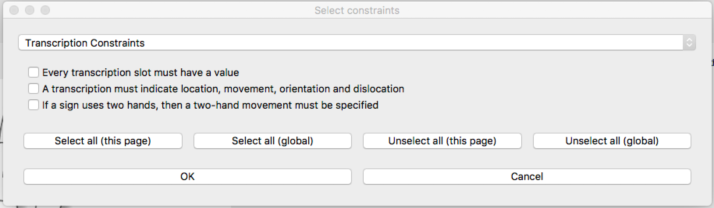

.. _setting_preferences:

***************
Setting Preferences
***************

Transcription preferences can be changed using the menu bar at the top of the screen.
You can look through them beforehand for intra-corpus consistency, or you can adjust 
them anytime during transcription.

.. _constraints:

Constraints
------------------

When you go to "Constraints" and click on "Select anatomical/phonological constraints", a new window
appears, titled "Select constraints". You can switch pages between "Transcription Constraints", "Simple Constraints", and 
"Conditional Constraints" using the pull-down menu. Check individual constraints that you would 
like to apply to your corpus, or use the "Select all" and "Unselect all" buttons. Click "OK".




Note that the constraints will NOT be automatically applied. To look for violations of 
the selected constraints in each sign, click on the "Check transcription" 
button (see :ref:`checking_transcriptions`).


.. _options:

Options
------------------

In "Options" on the menu bar, click on each option to select or unselect them.

* "Autosave"
* "Show save alert" gives you a confirmation message when a sign has been saved. 
* "Keep parameters window on top" keeps the parameters window open while still allowing you to transcribe handshapes on the background.
* "Warn about duplicate glosses" warns you when you try to save a sign with a gloss already existing in your corpus (see :ref:`save_sign`).


.. _transcriptions:

Transcriptions
------------------
.. _unrestricted transcriptions:

Allowing unrestricted transcriptions
``````````````````````````````````````````````````````
If you go to "Transcriptions" on the menu bar and select "Allow unrestricted transcriptions", it will
allow you to type in symbols that are not on the list of Permitted characters (see :ref:`field_and_slot`).


.. _blender:

Setting path to Blender
``````````````````````````````````````````````````````
"Set path to Blender..."
