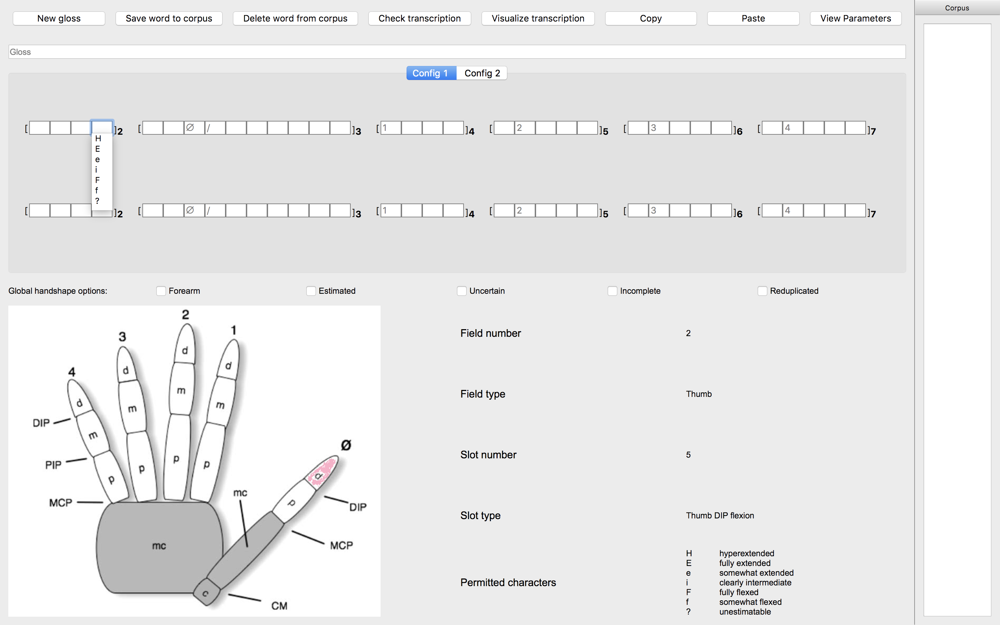

.. terminology:

***************
Terminology
***************

.. _corpus:

Corpus
------------------
"Corpus" refers to a group of signs that individual users have transcribed using the SLPAnnotator, and they are saved as a 
single file with the extention ".corpus".

.. _global_handshape_options:

Global handshape options
------------------

Global handshape options encode information about the whole sign. 
They can be checked when relevant.

Available options are:

* Forearm
* Estimated
* Uncertain
* Incomplete
* Reduplicated

.. _hand_and_config:

Hand and Config
------------------

"Hand 1" and "Hand 2" are synonymous to the dominant and nondominant hands,
respectively. "Config" (short for configuration) refers to handshape.
For example, "Config 2, Hand 1" is the second handshape of the dominant hand.
Hand 1 is transcribed in the upper row of each Config and Hand 2 the bottom row. Configs can be switched by clicking
on the buttons at the centre below the Gloss, named "Config 1" and "Config 2".
Depending on the signs, you do not necessarily have to fill all four rows.

.. _field_and_slot:

Field and Slot
------------------

"Fields" refer to the square brackets numbered from 1 to 7. "Slots" are square boxes
inside a field. Slot 1 in Field 1 is a global handshape option (see :ref:`global_handshape_options`) 
for forearm involvement. Field 2 to 7 are devoted to the thumb, thumb-finger contact, the index finger, the middle finger, 
the ring finger and the pinky finger, respectively.
If you click on any slot, a list of permitted characters will appear as a pull-down menu. 
Further information about that particular slot will appear at the bottom right corner.

For example, if you click on Slot 5 in Field 2, you will find the following information:

Field number is 2; Field type is Thumb; Slot number is 5; Slot type is Thumb DIP flexion; 
and permitted characters are H (hyperextended), E (fully extended), e (somewhat extended), i (clearly intermediate), 
F (fully flexed), f (somewhat flexed), and ? (unestimatable).

   

.. _parameters:

Parameters
------------------

"Parameters" refer to parameters other than handshapes (see :ref:`other_parameters` and :ref:`options`).
