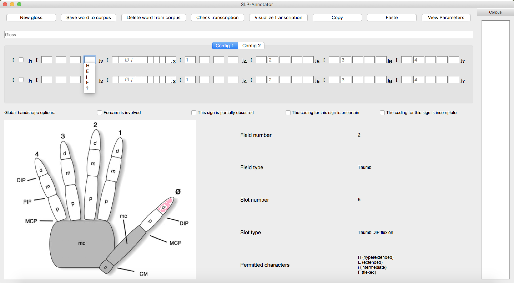

.. terminology:

***************
Terminology
***************

.. _global_handshape_options:

Global handshape options
------------------

Global handshape options encode information about the whole sign. 
They can be checked when relevant.

Available options are:

* Forearm is involved
* This sign is partially obscured
* The coding for this sign is uncertain
* The coding for this sign is incomplete

.. _hand_and_config:

Hand and Config
------------------

Hand 1 and Hand 2 are synonymous to the dominant and nondominant hands,
respectively. Config (short for configuration) refers to handshape. 
For example, Config 2, Hand 1 is the second handshape of the dominant hand. 
Depending on the signs, you do not necessarily have to fill all four of them.

.. _field_and_slot:

Field and Slot
------------------

Field refers to the square brackets numbered from 1 to 7. Slots are square boxes
inside a field. Slot 1 in Field 1 is a global handshape option (see :ref:`global_handshape_options`) 
for forearm involvement. Field 2 to 7 are devoted to the thumb, thumb-finger contact, 
and the four fingers.
If you click on any slot, a list of permitted characters will appear as a pull-down menu. 
Further information about that particular slot will appear at the bottom right corner.

For example, if you click on Slot 5 in Field 2, you will find the following information:

Field number is 2; Field type is Thumb; Slot number is 5; Slot type is Thumb DIP flexion; 
and permitted characters are H (hyperextended), E (extended), i (intermediate), and F (flexed).

   

.. _parameters:

Parameters
------------------

"Parameters," as in "View parameters" (see :ref:``) and Options > "Keep parameters
window on top" (see :ref:`options`), refers to parameters other than handshapes.
