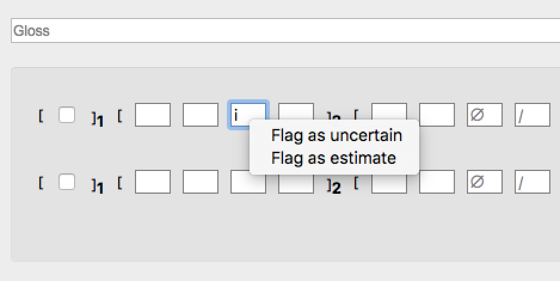
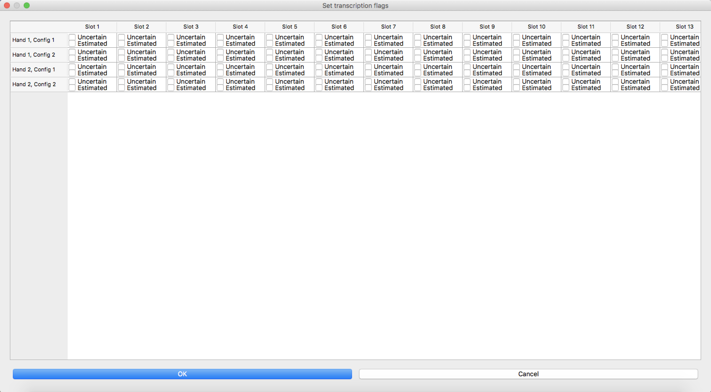
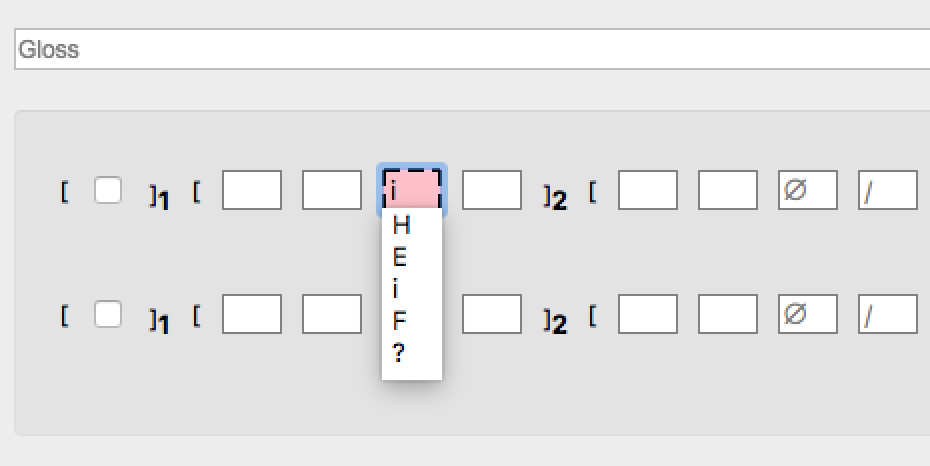
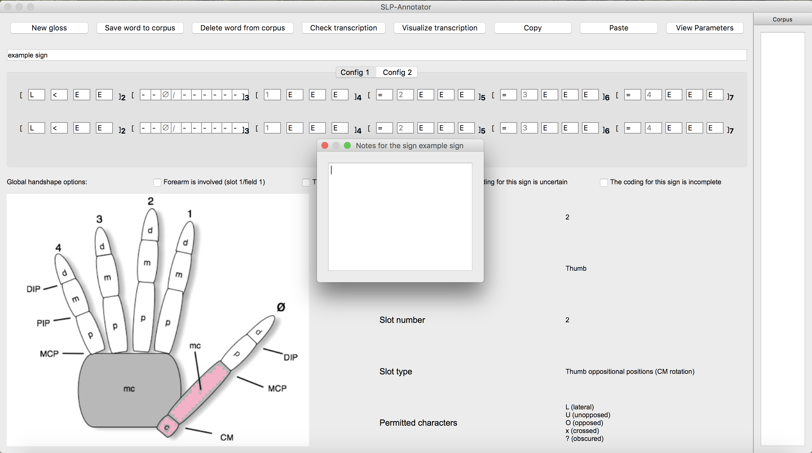
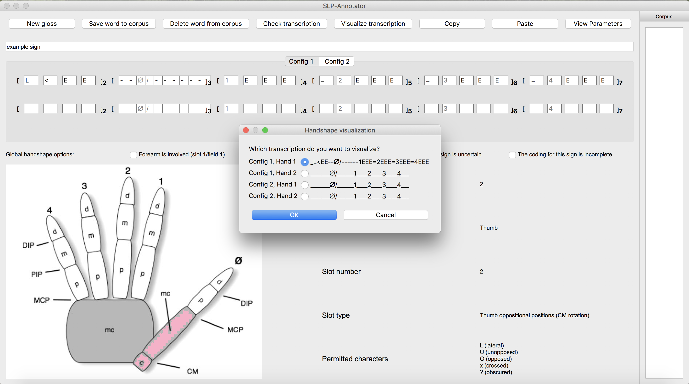
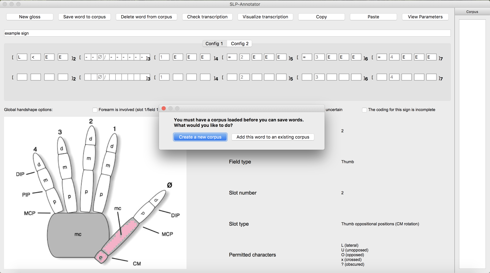
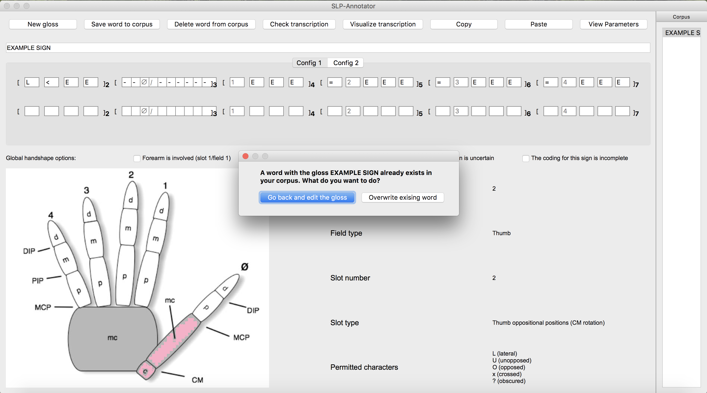

.. _transcription_process:

***************
Transcription process
***************

      Note that if you already have a corpus that you would like to continue on expanding, you can load the corpus at this point (see :ref:`add_signs`)


.. _enter_gloss:

1. Entering a Gloss
`````````````````
To enter a gloss for a sign, simply click on the text box named "Gloss" and type in. This box is case-sensitive.


.. _fill_slot:

2. Filling in a slot
`````````````````
To fill in a slot, you can either click on a slot to select a symbol from the pull-down menu or type in 
a symbol yourself (see :ref:`field_and_slot` as relevant).

      Notes on typing in a symbol
      
      * Slots are generally case-insensitive. An exeption is Slot 11, which has both [m] and [M] in its list of permitted characters.
      
      * In Slots 20, 25, and 30, use the key 'z' for [x-]; 'c' for [x+]; and 's' for [☒].
      
      * It may be helpful to use the Tab key to move to the next slot. To do this on Mac, go to System Preferences > Keyboard > Shortcuts. At the bottom of the page under "Full Keyboard Access", select "All controls".


.. _flag_slot:

3. Flagging a slot
`````````````````
You can optionally flag individual slots. "Flag as uncertain" will colour the slot, and 
"Flag as estimate" will mark the slot with a dotted line. 

To do this, control-click or rightclick a slot. A pull-down menu will appear, and you can select or unselect these options:



Alternatively, go to "Transcription" in the menu bar and select "Set transcription flags...". A new window will appear. You can expand and scroll through the window to flag any slot in any Config. Click "OK".



"Flag as estimate" is intended to note that, because of obscurity, a symbol has been estimated in some way (based on
knowledge of hand anatomy, a preceeding hand configuration, the other hand in a two-handed symmetrical sign, etc.).
"Flag as uncertain" is intended to stand for the transcriber's subjective uncertainty about their choice of a symbol.
Therefore, it is certainly possible to use these two options simultaneously when the transcriber is uncertain about their
estimation.




.. _copy_and_paste:

4. Copying and Pasting
`````````````````
Using the Copy and Paste functions, you can copy your transcription for one Config and paste it to to 
another Config within the same sign.

To copy your transcription, click on the "Copy" button at the top right corner or go to "Edit" in the menu bar and 
select "Copy a transcription...". A new window "Copy transcription" will appear. Select a Config that you would like to copy, 
and click "OK".

Similarly, to paste the transcription, click on the "Paste" button at the top right corner or go to "Edit" in the menu bar and 
select "Paste a transcription...". A new window "Paste transcription" will appear. Make sure that the intended trasnscription 
has been copied, and select a Config to which you would like to paste that transcription. If you would like to paste 
only the symbols and not the flags, then uncheck the option "Paste in highlighting for uncertain and estimated slots". 
Click "OK". 
Note that any existing symbols in the Config will be overwritten.

   For example, let's say you would like to copy your transcription for Config 1 of Hand 1 and paste it to Config 1 of Hand 2.
   
   
   First, click on the Copy button. In the new window, select Config 1, Hand 1, and click OK.
   
   .. image:: static/copy.png
      :width: 90%
      :align: center

  
   Second, click on the Paste button. In the new window, you can see the copied transcription in the first line, 
   introduced by    "The currently copied transcription is". Make sure that it is the correct one. 
   Then select "Config 1, Hand 2", and click "OK".
      
   .. image:: static/paste.png
      :width: 90%
      :align: center
   
   
   This function may be particularly useful for transcribing symmetrical signs or assymmetrical signs in which
   only the dominant hand changes its handshape.
   
   .. image:: static/paste_result.png
      :width: 90%
      :align: center
      

.. _check_global_handshape:

5. Checking Global handshape options
`````````````````
Global handshape options (see :ref:`global_handshape_options`) can be checked by simply cliking the box next to a description.
The options "Estimated" and "Uncertain" can be thought of as a global counterpart of the slot options "Flag as estimate" 
and "Flag as uncertain," respectively (see :ref:`flag_slot`).
In other words, it may be useful, for example, to check these Global handshape options when estimation or uncertainty applies
to a whole sign or a whole field(s) rather than individual slots.


.. _other_parameters:

6. Transcribing other parameters
`````````````````
To transcribe parameters other than handshapes, click on "View Parameters" button at the top right corner. A new window will
appear, and you can select relevant values. To transcribe handshapes and parameters at the same time, see :ref:`options`.

.. image:: static/.png
      :width: 90%
      :align: center


.. _add_sign_notes:

7. Adding Sign and Corpus notes
`````````````````
To add a note to a sign that you are transcribing, go to "Notes" in the menu bar and click on "Edit sign notes..." A new 
window will appear, and you can type in your comments. 


        
Sign notes are automatically saved when the signs are saved, and you can go back and edit them by following the above step.
It may be useful, for example, to use this sign notes to describe reasons for checking the Global handshape options.    

Similarly, "Notes" > "Edit corpus notes..." will allow you to add a note to the entire corpus.


.. _check_transcription:

8. Checking transcription
`````````````````
To check your transcription against your selected constraints (see :ref:`constraints`), click on "Check transcription" button.


.. _visualize_transcription:

9. Visualizing transcription
`````````````````
To see a graphic image of transcribed handshapes, click on "Visualize transcription" button. A new window titled 
"Handshape visualization" appears. Select a combination of Config and Hand you would like to visualize, and click "OK".




.. _save_sign:

10. Saving a sign to a corpus
`````````````````
Note that each sign should be saved before a next sign can be transcribed. To save a sign, either click on "Save word to
corpus" button or go to "File" in the menu bar and select "Save current word". You will get a message 
"Corpus successfully updated!" if "Show save alert" is selected in your setting (see :ref:`options`).


If you do not have a corpus loaded beforehand, you will get a warning message: "You must have a corpus loaded before you can
save words. What woule you like to do?". You can either "Create a new corpus" or "Add this word to an existing corpus".




If you have a sign with the same gloss already saved in the same corpus and "Warn about duplicate glosses" is selected in your
setting (see :ref:`options`), you will get a warning message: "A word with the gloss XXX already exists in your corpus. What do you want to do?".
You can either "Go back and edit the gloss" or "Overwrite existing word".




Finally, if you click on "New gloss" (see :ref:`next_sign`) without saving the current sign, you will get a warning message: 
"The current gloss has unsaved changes. what would you like to do?" It gives you options to either "Go back" to the current 
sign or to "Continue without saving". 
If this is the first time the sign is transcribed in the corpus, the latter option will delete a sign.


.. _next_sign:

11. Transcribing the next sign
`````````````````
Once a sign has been saved, if you would like to continue on transcribing a next sign, you can either click on 
the "New gloss" button or go to "File" and select "New gloss".

You can repeat the transcribing process from :ref:`enter_gloss`.


